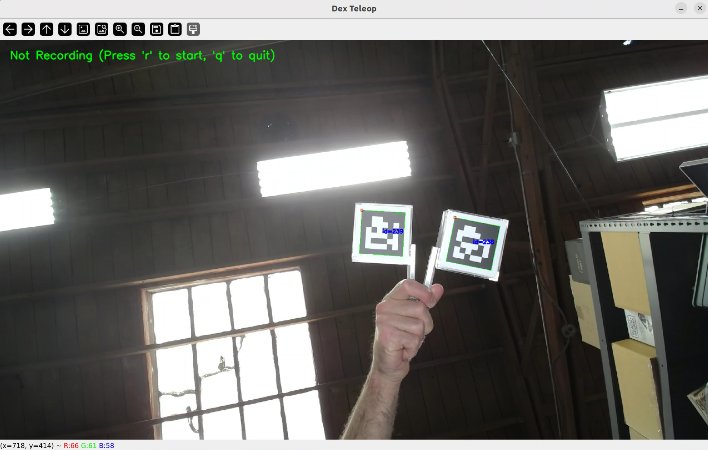
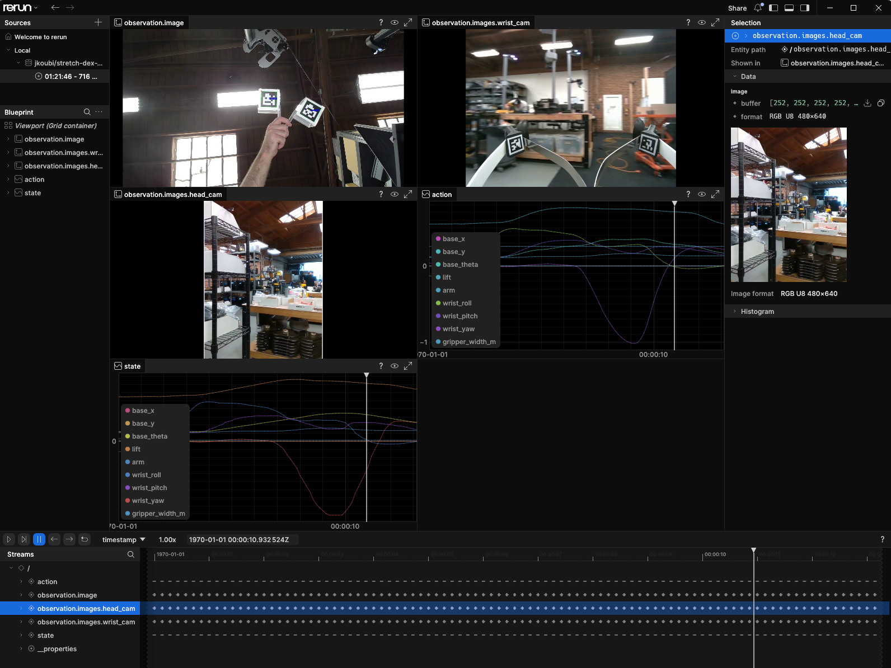

# Lightweight Data Recorder for Dex Teleop

## Motivation

We've been working on a lightweight data collection workflow for imitation learning built directly on top of standalone Stretch Dex Teleop.

The recorder runs without ROS 2 and keeps dependencies on the robot minimal, while a separate converter turns the recorded episodes into a proper [LeRobot](https://github.com/huggingface/lerobot)  dataset.

If you're using Stretch for imitation learning and want a simpler path from teleoperation to a LeRobot-ready dataset, this may be useful!

The pipeline spans two machines:

|Machine | Role | Script | Depends on LeRobot/PyTorch?|
|--- | --- | --- | ---|
|**Stretch robot** | Records raw episodes | `dex_teleop.py` | No|
|**Your dev machine** | Converts raw episodes to LeRobot format | `convert_to_lerobot.py` | Yes|

It captures synchronized robot telemetry, commanded teleoperation actions, and camera imagery from the wrist (D405) and head (D435i) cameras.

---

## 1. Recording an episode (on the robot)

Run this on the robot itself — needs a display, either the robot's own desktop or `ssh -X`/`-Y`.

One-time setup: follow [Setting Up Dex Teleop](https://github.com/hello-robot/stretch_dex_teleop/blob/feature/data-recorder/README.md#setting-up-dex-teleop) in the main README.

Every time you record:

```bash
cd ~/stretch_dex_teleop
python3 dex_teleop.py
```

<div align="center">
  
</div>

|Key  | Action | 
|--- | --- | 
|`r` | Start / stop recording an episode |  
|`y`/`n` | Answer Was the episode successful? (asked after stopping a non-empty recording, unless `--skip-success`) |  
|`q` | Quit (safely stops/labels an in-progress recording first) | 


Episodes land in `data/episode_YYYY-MM-DD--HH-MM-SS/` on the robot. Copy that directory to your dev machine (`scp -r`, `rsync`, USB drive, etc.) before converting.

---

## 2. Converting to LeRobot format (on your dev machine)

One-time setup — use a dedicated virtualenv, since `lerobot`'s dataset API has changed across versions before:

```bash
python3 -m venv ~/.venv-lerobot
source ~/.venv-lerobot/bin/activate
pip install lerobot==0.6.0
```

Every time you convert (`<your-hf-username>` is your Hugging Face account username):

```bash
# Create a brand-new dataset from the first episode:
python3 convert_to_lerobot.py \
  --episode-dir data/episode_2026-07-21--11-06-36 \
  --repo-id "<your-hf-username>/dataset-name" \
  --task "pick_up_the_mug"

# Add more episodes to that same dataset:
python3 convert_to_lerobot.py \
  --episode-dir data/episode_2026-07-21--11-30-02 \
  --repo-id "<your-hf-username>/dataset-name" \
  --task "pick_up_the_mug" \
  --append
```

`<your-hf-username>/dataset-name` is just the output folder name — one `--repo-id` per dataset, reused as-is across create/append/push, never a different value per step. It only needs the `username/name` shape if you plan to push later; for local-only use it can genuinely be anything.

By default this writes to `~/.cache/huggingface/lerobot/<your-hf-username>/dataset-name`. An episode marked `success.txt: Failure` is blocked by default — pass `--allow-failed` to convert it anyway.

---

## 3. Pushing to the Hugging Face Hub (on your dev machine)

Authenticate once per machine:

```bash
hf auth login
```

Add `--push` to any conversion command:

```bash
python3 convert_to_lerobot.py --episode-dir data/episode_2026-07-21--11-06-36 --repo-id "<your-hf-username>/dataset-name" --task "pick_up_the_mug" --push
```

**Pushes as public by default** — pass `--private` to keep it private. Worth deciding deliberately, since recorded episodes include real camera footage of your workspace.

**Visualizing a dataset**: the Hub's own viewer is PRO-gated for private datasets, but LeRobot's local visualizer works regardless of visibility, free:

```bash
pip install "lerobot[viz]"
lerobot-dataset-viz --repo-id <your-hf-username>/dataset-name --episode-index 0
```

<div align="center">
  
</div>

---

Full docs — architecture, complete CSV schema, converter internals, known limitations — are here: [`docs/data_recording.md`](https://github.com/hello-robot/stretch_dex_teleop/blob/feature/data-recorder/docs/data_recording.md).